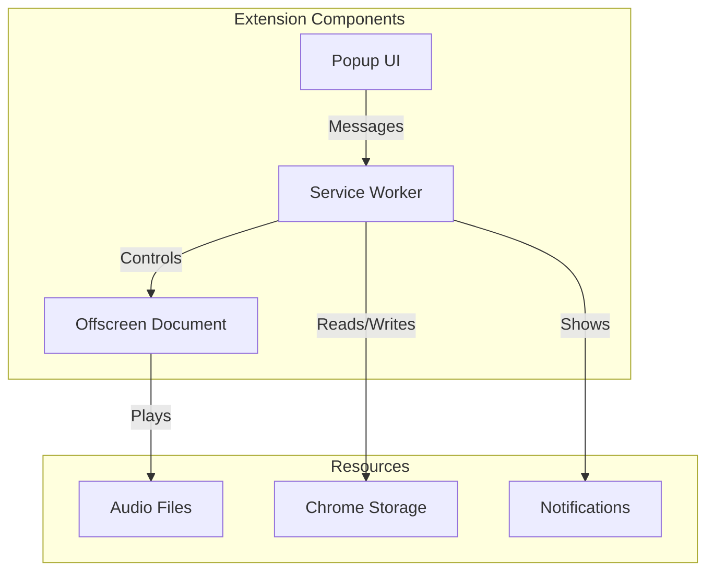

# Developer Guide

This guide provides comprehensive information for developers working on the Meditation Chrome Extension.

## 🏗️ Architecture Overview



### Key Components

1. **Service Worker** (`src/background/service-worker.js`)
   - Central message hub
   - Session management
   - Chrome API interactions

2. **Offscreen Document** (`src/offscreen/offscreen.js`)
   - Audio playback (required for Manifest V3)
   - Web Audio API usage
   - Voice queue management

3. **Popup UI** (`src/popup/`)
   - User interface
   - Settings management
   - Session controls

4. **Content Scripts** (`src/content/`)
   - Page integration (future feature)
   - Contextual meditation triggers

## 🚀 Development Setup

### Prerequisites

- Node.js 16+ and npm
- Chrome browser (latest stable)
- Git
- FFmpeg (for audio processing)
- Code editor with ESLint support

### Initial Setup

1. **Clone and install**:
   ```bash
   git clone https://github.com/yourusername/meditation-chrome-extension.git
   cd meditation-chrome-extension
   npm install
   ```

2. **Set up audio resources**:
   ```bash
   # Generate audio file list
   npm run generate:audio-list
   
   # Create placeholder audio for testing
   npm run generate:test-audio
   ```

3. **Configure environment** (optional):
   ```bash
   cp .env.example .env.local
   # Add any API keys for audio generation
   ```

### Development Workflow

1. **Start development mode**:
   ```bash
   npm run dev
   # Watches for changes and rebuilds automatically
   ```

2. **Load extension in Chrome**:
   - Navigate to `chrome://extensions/`
   - Enable "Developer mode"
   - Click "Load unpacked"
   - Select the `dist` folder

3. **Make changes**:
   - Edit source files in `src/`
   - Extension auto-reloads on rebuild
   - Click extension "Reload" button for manifest changes

## 📁 Project Structure

```
meditation-chrome-extension/
├── public/                    # Static assets
│   ├── manifest.json         # Extension manifest
│   ├── popup.html           # Popup UI HTML
│   ├── offscreen.html       # Offscreen document HTML
│   ├── icons/               # Extension icons
│   ├── _locales/            # Internationalization
│   │   ├── en/             # English messages
│   │   └── ja/             # Japanese messages
│   └── audio/              # Audio files (generated)
│       ├── voice/          # Voice guidance
│       └── background/     # Background music
├── src/                     # Source code
│   ├── background/         # Service worker
│   │   └── service-worker.js
│   ├── popup/              # Popup UI
│   │   ├── popup.js
│   │   └── popup.css
│   ├── offscreen/          # Audio playback
│   │   └── offscreen.js
│   ├── content/            # Content scripts
│   │   └── content.js
│   ├── lib/                # Shared libraries
│   │   ├── audio-manager.js
│   │   ├── storage-manager.js
│   │   ├── meditation-content.js
│   │   ├── tts-service.js
│   │   ├── tts-script-generator.js
│   │   └── audio-mapping.js
│   └── config/             # Configuration
│       └── constants.js
├── scripts/                 # Build/utility scripts
│   ├── generate-audio-list.js
│   ├── generate-audio-files.js
│   └── generate-tts-with-api.js
├── tests/                   # Test files
│   ├── unit/               # Unit tests
│   ├── integration/        # Integration tests
│   └── mocks/              # Mock implementations
├── docs/                    # Documentation
├── webpack.config.js        # Webpack configuration
├── jest.config.js          # Jest configuration
├── .eslintrc.js            # ESLint configuration
└── package.json            # Project dependencies
```

## 🔧 Development Tools

### NPM Scripts

```bash
# Development
npm run dev          # Start development with watch
npm run build        # Build for production
npm run clean        # Clean build artifacts

# Testing
npm test            # Run all tests
npm run test:watch  # Run tests in watch mode
npm run test:coverage # Generate coverage report

# Code Quality
npm run lint        # Run ESLint
npm run lint:fix    # Fix ESLint errors
npm run format      # Format with Prettier

# Audio Generation
npm run generate:audio-list  # Generate CSV of needed audio
npm run generate:test-audio  # Create placeholder audio
npm run generate:tts-api    # Generate with TTS APIs
npm run validate:audio      # Check all audio files exist
```

### Webpack Configuration

The project uses Webpack 5 with:
- Multiple entry points (service worker, popup, offscreen)
- ES6 module support
- Path aliases for clean imports
- Source maps for debugging
- Hot reload in development

Key aliases:
```javascript
'@config': 'src/config',
'@lib': 'src/lib',
'@popup': 'src/popup',
'@background': 'src/background'
```

### ESLint Configuration

Based on Airbnb style guide with modifications:
- ES6+ features enabled
- Chrome extension globals
- Import plugin for proper module resolution

## 🧪 Testing

### Test Structure

```javascript
// Example unit test
describe('StorageManager', () => {
  it('should return default preferences when none stored', async () => {
    const prefs = await storageManager.getUserPreferences();
    expect(prefs.language).toBe('en');
    expect(prefs.duration).toBe(10);
  });
});
```

### Running Tests

```bash
# Run all tests
npm test

# Run specific test file
npm test -- storage-manager.test.js

# Run with coverage
npm run test:coverage

# Debug tests
node --inspect-brk node_modules/.bin/jest --runInBand
```

### Test Categories

1. **Unit Tests** (`tests/unit/`)
   - Individual module testing
   - Mock Chrome APIs
   - Fast execution

2. **Integration Tests** (`tests/integration/`)
   - Component interaction
   - Message passing
   - Storage operations

3. **E2E Tests** (future)
   - Full extension flow
   - User interactions
   - Audio playback

## 🌐 Chrome Extension APIs

### Manifest V3 Considerations

This extension uses Manifest V3, which requires:
- Service workers instead of background pages
- Offscreen documents for audio playback
- Explicit host permissions
- No remote code execution

### Key APIs Used

#### chrome.runtime
```javascript
// Message passing
chrome.runtime.sendMessage({ type: 'START_MEDITATION', data: {...} });

// Get extension URL
const audioUrl = chrome.runtime.getURL('audio/voice/en/welcome.mp3');
```

#### chrome.storage
```javascript
// Store user preferences
await chrome.storage.local.set({ userPreferences: {...} });

// Retrieve with defaults
const { userPreferences = {} } = await chrome.storage.local.get('userPreferences');
```

#### chrome.offscreen
```javascript
// Create offscreen document for audio
await chrome.offscreen.createDocument({
  url: 'offscreen.html',
  reasons: ['AUDIO_PLAYBACK'],
  justification: 'Playing meditation audio'
});
```

## 🎨 UI Development

### Popup Interface

The popup uses vanilla JavaScript with:
- Event delegation for performance
- i18n for all text content
- Responsive design
- Accessibility features

### Styling Guidelines

```css
/* Use CSS variables for theming */
:root {
  --primary-color: #6B46C1;
  --text-color: #333;
  --background: #F5F5F5;
}

/* Mobile-first responsive design */
.container {
  padding: 1rem;
  max-width: 320px;
}
```

### i18n Implementation

```javascript
// In JavaScript
const message = chrome.i18n.getMessage('start_meditation');

// In HTML
<button data-i18n="start_meditation">Start</button>

// Auto-translate on load
document.querySelectorAll('[data-i18n]').forEach(el => {
  el.textContent = chrome.i18n.getMessage(el.dataset.i18n);
});
```

## 🔊 Audio System

### Audio File Management

```javascript
// Audio mapping structure
const VOICE_AUDIO_MAP = {
  en: {
    'welcome': 'welcome.mp3',
    'breathe_in': 'breathe-in.mp3',
    // ...
  },
  ja: {
    'welcome': 'welcome.mp3',
    'breathe_in': 'breathe-in.mp3',
    // ...
  }
};
```

### Web Audio API Usage

```javascript
// In offscreen document
const audioContext = new AudioContext();
const gainNode = audioContext.createGain();
gainNode.connect(audioContext.destination);

// Load and play audio
const response = await fetch(audioUrl);
const arrayBuffer = await response.arrayBuffer();
const audioBuffer = await audioContext.decodeAudioData(arrayBuffer);

const source = audioContext.createBufferSource();
source.buffer = audioBuffer;
source.connect(gainNode);
source.start(0);
```

## 🐛 Debugging

### Chrome DevTools

1. **Service Worker**:
   - Chrome Extensions page → "Inspect views: service worker"
   - Console logs, breakpoints, network inspection

2. **Popup**:
   - Right-click popup → "Inspect"
   - Standard DevTools available

3. **Offscreen Document**:
   - chrome://extensions → "Inspect views: offscreen.html"

### Common Issues

**Extension not updating**:
```bash
# Force reload
# 1. Make changes
# 2. Rebuild: npm run build
# 3. Click "Reload" in chrome://extensions
```

**Audio not playing**:
```javascript
// Check offscreen document exists
const contexts = await chrome.runtime.getContexts({
  contextTypes: ['OFFSCREEN_DOCUMENT']
});
console.log('Offscreen exists:', contexts.length > 0);
```

**Message passing errors**:
```javascript
// Always return true for async responses
chrome.runtime.onMessage.addListener((message, sender, sendResponse) => {
  handleMessage(message).then(sendResponse);
  return true; // Critical for async!
});
```

## 📦 Building for Production

### Build Process

```bash
# Clean previous build
npm run clean

# Build production bundle
npm run build

# Output in dist/ folder
```

### Pre-release Checklist

- [ ] All tests passing
- [ ] No console.log statements
- [ ] Audio files included
- [ ] Manifest version bumped
- [ ] CHANGELOG updated
- [ ] Documentation current

### Creating Release Package

```bash
# Create ZIP for Chrome Web Store
cd dist
zip -r ../meditation-extension-v1.0.0.zip *
```

## 🔒 Security Considerations

1. **Content Security Policy**:
   ```json
   "content_security_policy": {
     "extension_pages": "script-src 'self'; object-src 'self'"
   }
   ```

2. **Permissions**:
   - Only request necessary permissions
   - No host permissions needed (fully offline)

3. **Data Storage**:
   - All data stored locally
   - No external API calls in production
   - User data never leaves device

## 🤝 Contributing

### Code Style

- Follow ESLint rules
- Use meaningful variable names
- Comment complex logic
- Keep functions small and focused

### Git Workflow

```bash
# Create feature branch
git checkout -b feature/amazing-feature

# Make changes and commit
git add .
git commit -m 'Add amazing feature'

# Push and create PR
git push origin feature/amazing-feature
```

### Commit Message Format

```
type(scope): subject

body

footer
```

Types: feat, fix, docs, style, refactor, test, chore

### Pull Request Process

1. Update documentation
2. Add/update tests
3. Ensure all tests pass
4. Update CHANGELOG
5. Request review

## 📚 Resources

### Chrome Extension Development
- [Chrome Extension Documentation](https://developer.chrome.com/docs/extensions/mv3/)
- [Manifest V3 Migration](https://developer.chrome.com/docs/extensions/mv3/intro/)
- [Chrome APIs Reference](https://developer.chrome.com/docs/extensions/reference/)

### Web Audio
- [Web Audio API](https://developer.mozilla.org/en-US/docs/Web/API/Web_Audio_API)
- [Audio Context](https://developer.mozilla.org/en-US/docs/Web/API/AudioContext)

### Tools
- [Chrome Extension Source Viewer](https://chrome.google.com/webstore/detail/chrome-extension-source-v/jifpbeccnghkjeaalbbjmodiffmgedin)
- [Extension Reloader](https://chrome.google.com/webstore/detail/extensions-reloader/fimgfedafeadlieiabdeeaodndnlbhid)

## ❓ FAQ

**Q: Why use an offscreen document for audio?**
A: Manifest V3 service workers can't use Web Audio API directly. Offscreen documents provide a hidden context for audio playback.

**Q: How do I add a new meditation type?**
A: 1. Add to MEDITATION_TYPES constant
   2. Create content in meditation-content.js
   3. Add translations to _locales
   4. Update UI to show new option

**Q: Can I use TypeScript?**
A: The project uses JavaScript, but TypeScript can be added by:
   1. Install TypeScript dependencies
   2. Update webpack config
   3. Add tsconfig.json
   4. Rename .js files to .ts

---

For more help, check existing code patterns or open an issue on GitHub.